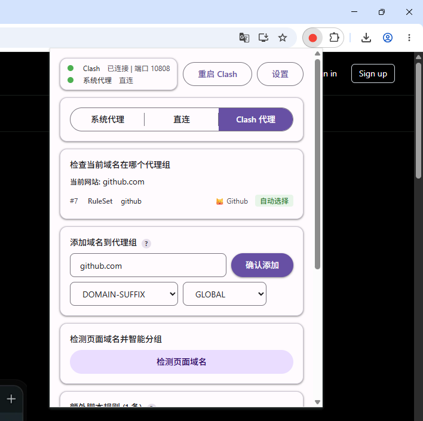
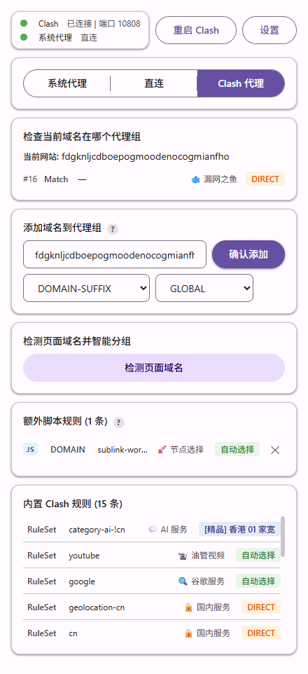
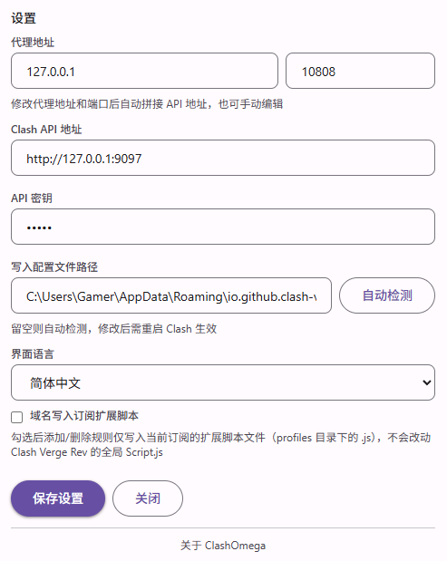

# ClashOmega

> Chrome 浏览器扩展，用于管理 Clash 代理规则。致敬 SwitchyOmega / ZeroOmega。

<div align="center">

[](https://github.com/ciskonc/ClashOmega)
[](https://github.com/ciskonc/ClashOmega)
[](LICENSE)
[](https://developer.chrome.com/docs/extensions/mv3/intro/)

[🌐 官网](https://magicalyuyu.github.io/ClashOmega/) · [中文](README.md) · [English](README_EN.md) · [更新日志](CHANGELOG.md)

</div>

---

## 界面预览

<table>
  <tr>
    <td align="center"><br>扩展图标与 Chrome 工具栏</td>
    <td align="center"><br>Clash 规则列表 + 扩展脚本规则管理</td>
    <td align="center"><br>节点设置</td>
  </tr>
</table>

## 功能

### 核心功能

| 功能 | 说明 |
|------|------|
| 三模式切换 | 系统代理 → 直连 → Clash 代理，一键切换，图标颜色实时变化 |
| 域名匹配检测 | 检测当前域名匹配的 Clash 规则，显示匹配的分组和策略（支持 RULE-SET 回退到 `/connections` API 查询） |
| 快捷添加规则 | 将当前域名添加到代理组（动态获取 Clash 代理组列表） |
| 智能域名分组 | 检测页面所有域名，自动分组建议（如 `i1.art.com`, `i2.art.com` → `*.art.com`） |
| 系统代理状态 | 实时显示系统代理状态（Native Host 读取注册表 + 浏览器代理 API 兜底，兼容豆包等浏览器） |
| 规则管理 | 查看、添加、删除 Clash YAML 配置文件中的规则（增删后自动热重载） |
| 重启 Clash | 一键将 profile 规则同步到 Clash Verge Rev 快照文件并重启内核（热重载失效时使用） |

### UI/UX 功能（v1.3.0 新增）

| 功能 | 说明 |
|------|------|
| 四标签页布局 | 代理 / 规则 / 域名 / 设置四个标签页，支持拖拽排序与模块跨标签页迁移 |
| 多主题系统 | MD3 亮色 / MD3 暗色 / 玻璃拟态亮色 / 玻璃拟态暗色 / 自动跟随系统 |
| 全局字号缩放 | 70%-130% 字号调节，实时预览 |
| 规则分页与搜索 | 可配置每页规则数（10/20/50/100）+ 200ms 防抖搜索 |
| 多语言 | 简体中文 / English / 日本語 |

### 安装与安全（v1.3.0 新增）

| 功能 | 说明 |
|------|------|
| 自动化安装脚本 | `install_all.ps1` 支持 9 种浏览器自动检测与安装（Chrome/Edge/Brave/Opera/Vivaldi/豆包/360/QQ/搜狗） |
| Clash API 自动发现 | 从 Clash Verge Rev 配置文件读取端口 + 端口扫描 + 401 认证检测 |
| 安全加固 | 修复 13 项安全漏洞（XSS、路径遍历、进程注入、CSP 缺失等） |

## 安装

### 方式一：自动化安装（推荐，v1.3.0 新增）

1. 右键 `native-host/install_all.ps1` → **使用 PowerShell 运行**
2. 脚本会自动检测已安装的浏览器，选择目标浏览器
3. 脚本会自动加载扩展、提示输入扩展 ID、注册 Native Host、检测 Clash API
4. 完成后即可使用

> 前置条件：需开启 PowerShell 脚本执行权限（见下方说明）

### 方式二：手动安装

#### 1. 加载扩展

1. 打开 `chrome://extensions/`
2. 开启右上角「开发者模式」
3. 点击「加载已解压的扩展程序」
4. 选择 `extension/` 目录

#### 2. 安装 Native Messaging Host

Native Host 用于读写 Clash 本地 YAML 配置文件（仅 Windows）。

<details>
<summary>📖 开启 PowerShell 脚本执行权限（点击展开）</summary>

> Native Host 依赖 PowerShell 脚本（`.ps1`），Windows 默认禁止运行脚本，需先开启执行权限，否则 Native Host 无法启动。

方式一（推荐）：Windows 设置
1. 打开「设置」→「隐私和安全性」→「开发者选项」（Windows 11 为「设置」→「系统」→「开发者选项」）
2. 找到「PowerShell」→「更改执行策略以允许本地 PowerShell 脚本在没有签名的情况下运行」→ 开启

方式二：PowerShell 命令
1. 以管理员身份打开 PowerShell
2. 执行：`Set-ExecutionPolicy RemoteSigned -Scope CurrentUser`
3. 输入 `Y` 确认

</details>

1. 在 `chrome://extensions/` 中找到 ClashOmega 扩展，复制其 ID
2. 右键 `native-host/install.ps1` → **使用 PowerShell 运行**
3. 粘贴扩展 ID，回车完成安装
4. 刷新扩展

#### 3. 配置 Clash API

1. 点击扩展图标 → 设置（齿轮按钮）
2. 填写 Clash API 地址（默认 `http://127.0.0.1:9090`）和密钥
3. 配置文件路径留空则自动检测（支持 Clash Verge Rev 的 `profiles.yaml`）

---

<details>
<summary>📖 使用说明（点击展开）</summary>

### 添加/删除规则后会自动生效吗？

会。增删规则成功后，扩展会自动通过 Clash API `/configs?force=true` 热重载配置（500ms 防抖）。

底部的「重启 Clash」按钮是更彻底的方式：将 profile 规则写入 Clash Verge Rev 快照文件（`clash-verge.yaml`）并重启内核，仅在热重载失效时使用。

### 为什么我的自定义规则不生效？

Clash 内核自上而下顺序匹配，第一个匹配的规则生效。如果你的自定义规则位于 `RULE-SET,...` 等规则集之后，且域名被包含在规则集中，则永远不会命中自定义规则。

解决方案：将自定义规则移到 rules 列表顶部（`RULE-SET` 之前）。

### 为什么域名匹配显示为兜底规则（MATCH）？

可能原因：
1. 域名确实没有匹配任何规则，落到 `MATCH` 兜底规则
2. 规则类型是 `RULE-SET`，浏览器端无法解析规则集内容，扩展会回退到 Clash API `/connections` 查询实际匹配结果（需该域名有活跃连接）

> 注：MATCH 兜底规则对应的代理组名称由你的订阅配置决定（如「最终」「漏网之鱼」等），本扩展只负责显示实际匹配结果。

### 为什么系统代理状态显示异常？（v1.3.0 改进）

部分 Chromium 内核浏览器（如豆包）对 Native Host 的支持存在异常，导致无法通过注册表读取系统代理。v1.3.0 已添加 `chrome.proxy.settings.get()` 浏览器 API 作为兜底方案，支持 5 种代理模式检测（direct / auto_detect / pac_script / fixed_servers / system）。

</details>

---

<details>
<summary>🔧 技术栈与项目结构（点击展开）</summary>

## 技术栈

- 前端: Chrome Extension Manifest V3 + Vanilla JS + CSS3 (MD3)
- 后端: Native Messaging Host (PowerShell)
- 通信: `chrome.runtime.sendMessage` + `chrome.runtime.sendNativeMessage`
- API: Clash REST API (`GET /configs`, `/rules`, `/proxies`, `/connections`)

## 项目结构

```
extension/          # Chrome 扩展
├── manifest.json   # MV3 清单（含 CSP）
├── background.js   # Service Worker（消息分发 + 热重载）
├── lib/            # 模块
│   ├── clash-api.js       # Clash REST API 封装
│   ├── native-bridge.js   # Native Host 通信桥接（含 sendToNativeSafe）
│   ├── proxy-manager.js   # 代理模式切换
│   └── domain-detector.js # 页面域名检测
├── popup/          # 弹窗 UI
│   ├── popup.html   # 四标签页结构
│   ├── popup.js     # 标签页系统 + 拖拽排序 + 主题切换 + 域名匹配 + 规则增删
│   └── popup.css    # MD3 + 玻璃拟态多主题样式
├── locales/        # 多语言文件（zh_CN / en / ja）
└── icons/          # 模式图标

native-host/        # Native Messaging Host（Windows）
├── install.ps1              # 手动安装脚本（注册 Native Host）
├── install_all.ps1          # 自动化安装脚本（多浏览器，v1.3.0 新增）
├── clash_rules_manager.bat  # 启动入口
├── clash_rules_manager.ps1  # 主程序（YAML 读写 + 系统代理查询）
└── com.clash.omega.json     # Native Host 清单模板
```

</details>

## 兼容性

- 浏览器: Chrome / Edge / 豆包 / 360 / QQ / Brave / Opera / Vivaldi 等 Chromium 内核浏览器（需支持 MV3）
- 代理内核: 本扩展基于 Clash Verge Rev 开发与测试，其他 Clash 内核（如 Clash for Windows / Mihomo 等）未测试，可能可用但不保证
- 操作系统: Windows（Native Host 依赖 PowerShell 5.1+）

---

<details>
<summary>📦 相关推荐：sublink-worker（点击展开）</summary>

### [sublink-worker](https://github.com/ciskonc/sublink-worker)

> One Worker, All Subscriptions — 轻量级订阅转换与管理面板，可部署于 Cloudflare Workers / Vercel / Node.js / Docker。

Fork 自 [7Sageer/sublink-worker](https://github.com/7Sageer/sublink-worker)，在原版基础上做了以下重点增强：

#### 新增功能

- AnyTLS 协议支持 — 新增 `anytls://` 协议解析器，AnyTLS 链接会被正确解析并转换为 Clash / Sing-Box 原生 AnyTLS 节点（原版会静默丢弃）
- GFWList 规则 — 基于 `geosite:category-gfw` 新增 GFWList 规则组，默认走代理
- GFWList 自动合并 — 选中 GFWList 但未选 Social Media / Google / Youtube / Github 时，自动拉取 `twitter/google/youtube/github/gitlab` 站点规则，修复 `x.com` 等 GFW 屏蔽但被 v2fly 归类到 `geosite:twitter` 而非 `category-gfw` 的域名

#### 规则默认值调整（白名单模式）

- 非中国域名和兜底规则默认改为直连（原版为节点选择）
- GFWList 默认走节点选择（代理）
- 规则优先级：特定规则（Google / Telegram / Github...）> GFWList > 非中国（直连）> 兜底（直连）
- 实现白名单代理模式：只有 GFW 屏蔽的域名走代理，其他全部直连

#### 多订阅合并修复

- 禁用 proxy-provider — 返回 Clash YAML 格式的订阅不再自动转为 `proxy-providers`，所有节点内联到最终配置，避免 UA 限制或 token 认证导致运行时拉取失败
- proxy-groups 隔离 — 订阅自带的 `proxy-groups` 不再合并到输出配置，只保留 Web UI 中选择的规则组

#### 支持协议

ShadowSocks、VMess、VLESS、AnyTLS、Hysteria2、Trojan、TUIC

#### 客户端支持

Sing-Box、Clash（Meta/Mihomo）、Xray/V2Ray、Surge

可配合本扩展使用：sublink-worker 负责订阅转换与节点生成，ClashOmega 负责运行时规则管理与域名匹配检测。

</details>

## 致谢

- [MagicalYu](https://github.com/MagicalYuYu) — 首席小白鼠兼 AI 编码调教师。本项目开发期间，以独到的"调教"技巧让 AI 高效产出可用的代码。没有他的阴阳怪气，就没有现在的 ClashOmega。

## 版本历史

完整版本历史请查阅 [CHANGELOG.md](CHANGELOG.md)。

## 许可证

MIT License
